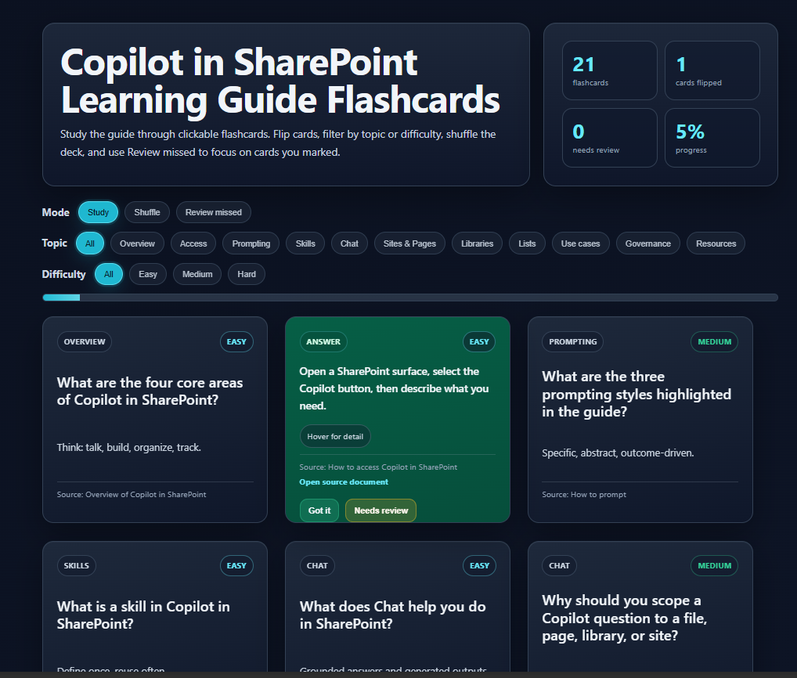

# Flashcards Dashboard

Creates an interactive HTML learning dashboard from a source file (PowerPoint, PDF, Word, etc.) by extracting key concepts into validated flashcards. Includes animated flip cards, category and difficulty filters, hover-detail answers, source links, Review missed mode, Shuffle, and progress tracking.

## What you get

- Self-contained interactive HTML dashboard with animated flip flashcards
- Cards extracted from the source file (12–25 by default) with question, concise answer, expanded detail, hint, category, difficulty, and source anchor
- Category and difficulty filters
- Hover / keyboard-focus detail panels that stay visible and are not clipped
- Source links that open the original document in a new tab with one left-click in SharePoint
- Study, Shuffle, and Review missed modes
- Progress tracking and “Got it” / “Needs review” actions
- Stable card IDs so review tracking survives filtering and shuffling
- Fully inline CSS/JS — no external dependencies
- Refined dark design system with clear hierarchy and accessibility considerations

## SharePoint Skill

| Solution | Author(s) |
| --- | --- |
| flashcards-dashboard | Anand &#124; [GitHub](https://github.com/anandVragav) &#124; [LinkedIn](https://www.linkedin.com/in/anand-vijayaragavan-89443012/) |

## Version history

| Version | Date | Comments |
| --- | --- | --- |
| 1.0 | July 2026 | Initial Release |

## Disclaimer

**THIS CODE IS PROVIDED _AS IS_ WITHOUT WARRANTY OF ANY KIND, EITHER EXPRESS OR IMPLIED, INCLUDING ANY IMPLIED WARRANTIES OF FITNESS FOR A PARTICULAR PURPOSE, MERCHANTABILITY, OR NON-INFRINGEMENT.**

