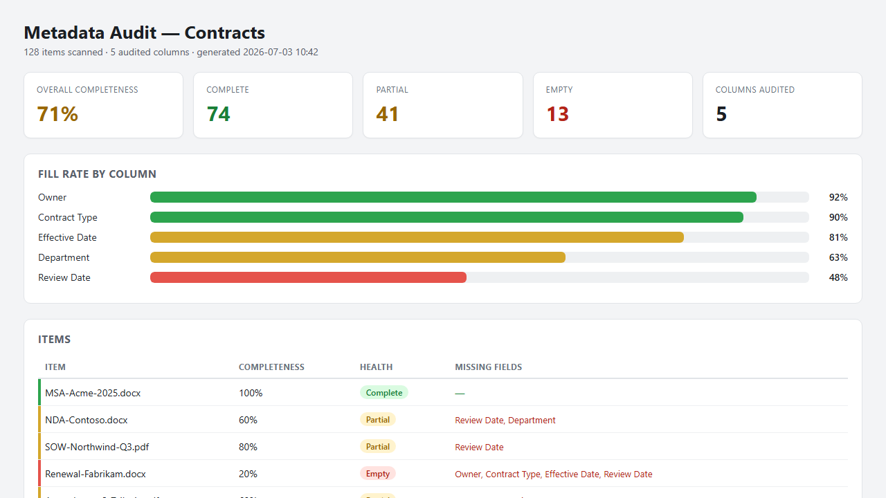

# Metadata Completeness Auditor

Audits the metadata quality of a SharePoint document library or list. It scans every item
against its required columns, flags missing, blank, and placeholder values (like `TBD` or
`N/A`), scores completeness per item and per column, and saves a self-contained HTML gap-report
dashboard to the site — no Power Automate, no custom code. It is strictly read-only.

## What you get

- A completeness score for the whole library, for every audited column, and for every item
- Each item classified as **Complete**, **Partial**, or **Empty**, with the exact list of
  missing fields
- Placeholder detection — values like `N/A`, `TBD`, `-`, `Choose an option`, and `pending`
  are treated as missing, not filled
- A color-coded HTML dashboard: summary band, per-column fill-rate bars, item table, owner
  breakdown, and a prioritized remediation list — saved to a `Metadata Reports` folder
- Strictly read-only: it never creates columns, changes items, or modifies the list — the only
  thing it writes is the HTML report

## When to use

Ask Copilot any of the following (or close variations):

- *"metadata audit"* / *"audit metadata"*
- *"metadata completeness"* / *"metadata health"* / *"metadata quality"*
- *"missing metadata"* / *"which items are missing metadata"*
- *"check metadata"* / *"metadata gap report"*
- *"find blank columns"*

Be in the library you want to audit, name one, or have items selected — the skill audits the
current library by default.

## Prerequisites

- A SharePoint document library or list with metadata columns.
- Read access to the library. The skill only reads the schema and items and writes an HTML
  report file — it never changes the list or its items, so no contributor permission or column
  setup is required.

## Demo content

Sample content for trying this skill end-to-end is in the [demo/](./demo/) subfolder. It includes a ready-made Contracts CSV (30 rows with deliberately uneven metadata) plus the expected audit results to verify against. Skip this folder when uploading the skill to SharePoint.

## SharePoint Skill

| Solution | Author(s) |
| --- | --- |
| metadata-completeness-auditor | Lovy Jain &#124; [GitHub](https://github.com/lovyjain) |

## Version history

| Version | Date | Comments |
| --- | --- | --- |
| 1.0 | July 2026 | Initial Release |

## Disclaimer

**THIS CODE IS PROVIDED _AS IS_ WITHOUT WARRANTY OF ANY KIND, EITHER EXPRESS OR IMPLIED, INCLUDING ANY IMPLIED WARRANTIES OF FITNESS FOR A PARTICULAR PURPOSE, MERCHANTABILITY, OR NON-INFRINGEMENT.**

