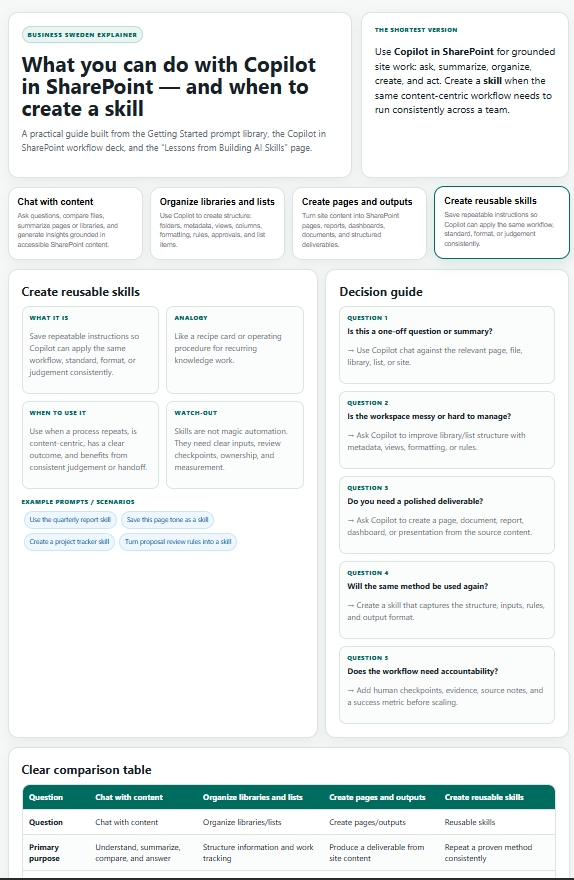

# Topic Explainer

Creates a polished, interactive explainer dashboard for any business, technical, or strategic topic. Uses a consistent, professional Business Sweden-style structure featuring concept cards, comparisons, decision guides, use cases, governance notes, and source attribution. Outputs a fully self-contained HTML dashboard ready for SharePoint pages, sharing, or embedding.

## What you get

- A modern, card-based interactive HTML dashboard tailored to the requested topic
- Professional Business Sweden tone with clear analogies, plain-language definitions, practical examples, and watch-outs
- Adaptive layout that only includes the most relevant sections for the topic (hero + shortest version, core concept cards, active detail panel, comparison tables, decision guides, use cases, governance notes, source notes)
- Fully standalone HTML/CSS/JavaScript — no external dependencies or build step required
- Searchable/filterable use cases (when applicable)
- Easy to save as a `.html` file directly in SharePoint or share as a single file
- Consistent, high-quality structure that works across topics while staying focused and scannable

## SharePoint Skill

| Solution | Author(s) |
| --- | --- |
| explainer | Anand &#124; [GitHub](https://github.com/anandVragav) &#124; [LinkedIn](https://www.linkedin.com/in/anand-vijayaragavan-89443012) |

## Version history

| Version | Date | Comments |
| --- | --- | --- |
| 1.0 | July 2026 | Initial Release |

## Disclaimer

**THIS CODE IS PROVIDED _AS IS_ WITHOUT WARRANTY OF ANY KIND, EITHER EXPRESS OR IMPLIED, INCLUDING ANY IMPLIED WARRANTIES OF FITNESS FOR A PARTICULAR PURPOSE, MERCHANTABILITY, OR NON-INFRINGEMENT.**

